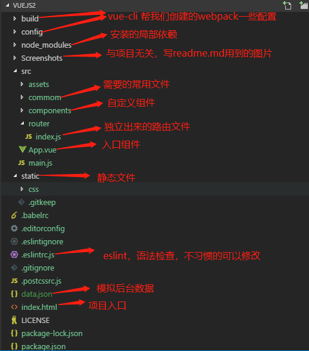
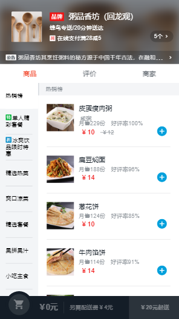
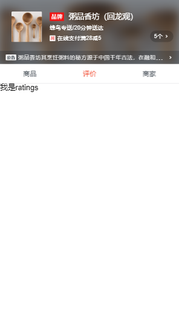
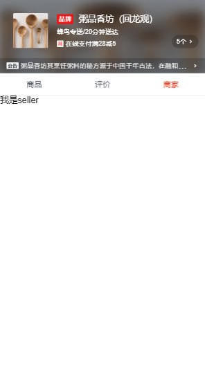
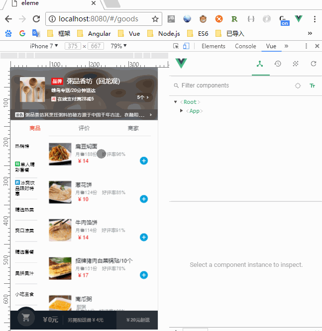
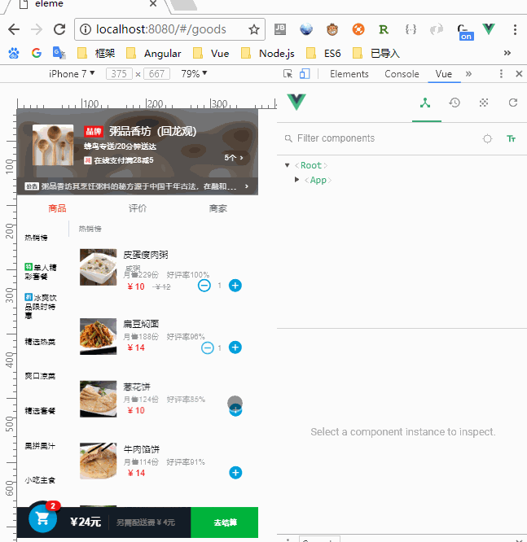

# Vue.js2
A vue-cli+webpack demo  
 
阅读注意：
- node.js npm 必备的哦！ 
- 本项目组件采用就近维护，一个组件一个文件夹，文件夹下面有本组件需要的图片资源，项目使用webpack build之后图片会以base64的形式加载,
- 本项目使用的是less

# 开始：
# 安装依赖
npm install  
注意：我项目中有可能使用到了全局模块，导致该模块不存在于package.json中，不过问题不大，按照提示 npm install 对应的模块即可
# 运行项目
npm run dev

# 打开项目
打开浏览器输入 http://localhost:8080

# 分析项目
## 目录结构


## mock 数据
- 位于根目录下面的 data.json文件
- webpack.dev.conf.js文件的62行  用node.js express 写三个get请求的接口。
```
    before (app) {
      app.get("/api/seller", (req, res) => {
        res.json({ errno: 0, data: seller });
      });  
      app.get("/api/goods", (req, res) => {
        res.json({ errno: 0, data: goods });
      });
      app.get("/api/ratings", (req, res) => {
        res.json({ errno: 0, data: ratings });
      }); 
    }
```

## 路由
在/src/router/index.js中配置路由
```
routes: [
    {
      path: '/goods',
      name: 'Goods',
      component: goods
    },
    {
      path: '/',
      redirect: '/goods'
    },
    {
      path: '/ratings',
      name: 'Ratings',
      component: ratings
    },
    {
      path: '/seller',
      name: 'Seller',
      component: seller
    }
  ]
```
## 使用路由
在App.vue中
```
<template>
  <div id="app">
    <v-header :seller = "seller"></v-header>
    <div class="tab">
      <div class="tab-item">
        <router-link to = "/goods">商品</router-link>
      </div>
      <div class="tab-item">
        <router-link to = "/ratings">评价</router-link>
      </div>
      <div class="tab-item">
        <router-link to = "/seller">商家</router-link>
      </div>
    </div>
    <router-view :seller="seller"></router-view>
  </div>
</template>
```

效果如图  




## header组件开发
- 在/src/components/header/header.vue中  
写好模板，样式(本项目使用less预处理器)，接受参数
- 在App.vue中使用，并请求数据，把数据传给子组件header.vue  
- header 弹出窗口中的关闭按钮，使用的stick footer布局
```
//在template中使用
<v-header :seller = "seller"></v-header>
//在js中引用
<script>
  import header from '@/components/header/header.vue'
  const ERR_OK = 0

  export default {
    components: {
      'v-header': header
    },
    data() {
      'use strict'
      return {
        seller: {}
      }
    },
    beforeCreate() {
      //ajax请求后台数据，ES6的箭头函数，和promise
      this.$http.get('/api/seller').then(response => {
        response = response.body;
        if (response.errno === ERR_OK) {
          this.seller = response.data
        }
      })
    }
  };
</script>
```
header预览  


## 星星评分组件开发
在header中有商家评分，评分可能用在多个地方，这里把评分抽象出来一个组件。名字叫做star

在父组件中使用,把星星的尺寸和星星个数传给子组件
```
<star :size="48" :score="seller.score"></star>
```
star组件中接受参数，并设置样式
```
<template>
    <div class="star" :class="starType">
        <span v-for="(itemClass,index) in itemClasses" :key="index" :class="itemClass" class="star-item"></span>
    </div>
</template>
```

## 商品组件开发
- 商品组件分两栏，左侧固定宽度导航，和右侧商品列表;两栏布局这里使用display:flex，左侧占80px;右侧占剩余的。
- 让导航和产品列表都能滑动，使用了基于iScroll的better-scroll,并且左右能联动。
- 商品组件需要请求'/api/goods'接口获取数据
- tempalte中使用v-for循环给模板赋值

预览：  



## 添加商品按钮开发
- 增删商品按钮在商品组件中使用到了，在购物车组件中使用到了，在商品详情页中页使用到了，所以开发成一个组件。
- 父组件给子组件传数组，父组件使用子组件方法。
- 点击商品事件和点击增删按钮事件会穿透，需要阻止冒泡，否则增删按钮点不到。
- 选择商品数为0的时候一定要加判断，不能继续点击了，否则点击过快会出现负数。
- 操作父级传过来的food.count
- 难点是购物车，还有详情页也需要使用该组件，并且数据是相通的，本组件操作父组件的food,并添加count属性，父组件遍历一下所有的food，选择出所有的选择过的food,selectFoods(),返回值是一个选中食物的数组，传递给购物车组件，这样就实现了两个兄弟组件的传值

预览：  


## 购物车组件
- 根据选择商品价钱的多少显示相应的样式。
- 点击购物车会出现购物清单，可以增删商品，可以清空商品。
- 接受父组件传过来的配送费，起送价格，还有选择的商品和个数

预览：  


## 商品详情页组件
- 接受父组件传过来的数据并展示

## 评价组件
- 能根据选择不同而展示不同类的评论，如只显示有内容的评论，全部，推荐，吐槽
- 时间戳转化成2018-5-21 05:21 这种形式的时间


